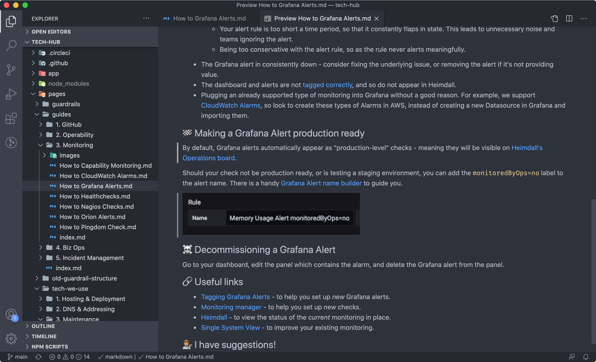
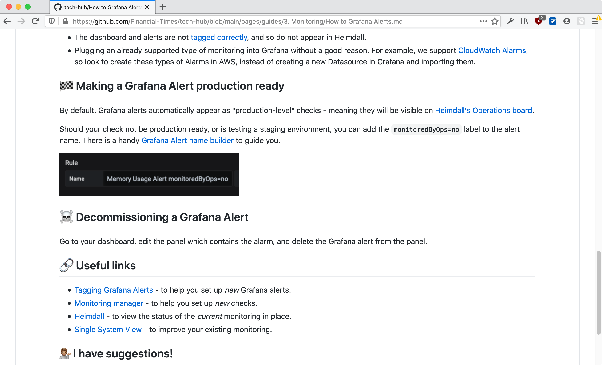
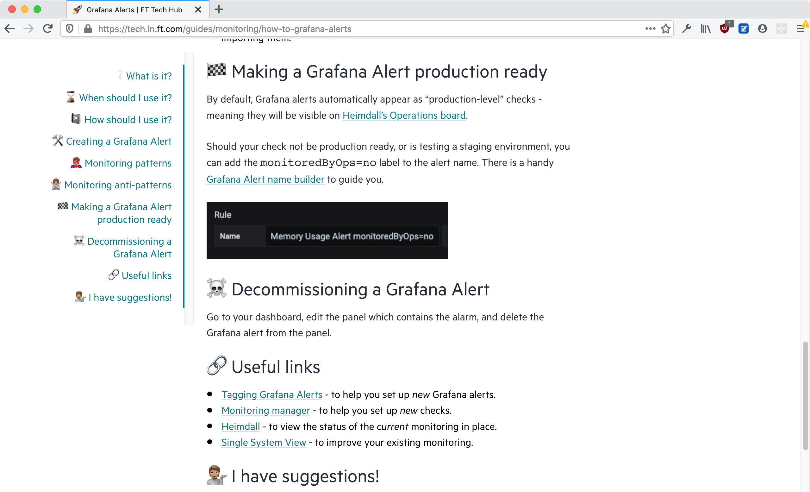

# @financial-times/express-markdown-pages

[](https://circleci.com/gh/Financial-Times/express-markdown-pages) [](https://www.npmjs.com/package/@financial-times/express-markdown-pages)

An Express middleware that transforms plain text files into dynamic pages and fits right into your existing app.

```js
const { MarkdownPages } = require('@financial-times/express-markdown-pages');

const markdownPages = new MarkdownPages();

app.get('/*', markdownPages.middleware, (request, response) => {
	const html = myTemplate(response.locals.markdownPages);
	response.send(html);
});
```

[1]: https://github.com/Financial-Times/biz-ops-api#api

## Installation

This is package for [Node.js] and is available through the [npm] registry. Node 12 or higher is required.

Installation is done using the [npm install] command:

```bash
npm install -S @financial-times/express-markdown-pages
```

[node.js]: https://nodejs.org/
[npm]: http://npmjs.com/
[npm install]: https://docs.npmjs.com/getting-started/installing-npm-packages-locally

## Features

-   Fits right into your existing Express app, how you render the output is up to you!
-   Finds and transforms Markdown files into HTML with Origami compatible output.
-   Author content that works in your editor, on GitHub, and on your website.
-   Generates hierarchical navigation and user-friendly URLs.
-   Supports taxonomies to dynamically group and filter content.
-   Include images alongside your Markdown content, they'll work too.

## Getting started

Start by creating a new instance of `MarkdownPages` and provide the appropriate [options](#options) for your app:

```js
const { MarkdownPages } = require('@financial-times/express-markdown-pages');

const markdownPages = new MarkdownPages({
	source: './content',
	pathPrefix: '/docs',
});
```

Next, add a new route to your app to serve your Markdown pages from, please note this must end with an asterisk (`*`) so that Express knows to route all requests to URLs beginning with this path through the `MarkdownPages` middleware:

```js
app.get('/docs*');
```

Next, add the `MarkdownPages` middleware to the route you just added:

```js
app.get('/docs*', markdownPages.middleware);
```

Next, add a final [route handler] function. This function can use [the data](#page-data) added by the middleware to render your pages. Please note, if a page can't be found, or the incoming request is for an image file, then this function will not be called:

```js
app.get('/docs*', markdownPages.middleware, (request, response) => {
	response.send(response.locals.markdownPages);
});
```

Finally, we recommend initialising `MarkdownPages` on app startup. This is not strictly necessary but it will help you to spot any errors with your content and you can also store a reference to the created database for access later:

```js
try {
	const db = await markdownPages.init();
	const pageCount = db.getCollection('pages').count();

	app.listen(PORT, () => {
		console.log(`App listening on http://localhost:${PORT}`);
		console.log(`Successfully loaded ${pageCount} pages`);
	});
} catch (error) {
	console.error('The app failed to start: ', error);
	process.exit(1);
}
```

Now you're up and running you can get on with using [the data](#page-data) in your templates or carry on to the [JSDoc documentation](docs/jsdoc.md) for more examples.

[route handler]: https://expressjs.com/en/guide/routing.html#route-handlers

### Options

See the [JSDoc type definitions](docs/jsdoc.md#Options) for more information about configuration options.

### Debugging

This package implements [debug] to provide detailed logs. You can enable these by setting the `DEBUG` environment variable:

```shell
DEBUG=express:markdownPages node app.js
```

[debug]: https://www.npmjs.com/package/debug

### Page data

The middleware provided by this package will append a `markdownPages` property to the [`response.locals` object](https://expressjs.com/en/4x/api.html#res.locals) when a page matching the request is found. This object includes the content for the requested page and navigation hierarchy, and for [index pages](docs/writing-content.md#index-pages) it will also include any information about taxonomies and tags used by child pages.

See the [JSDoc type definitions](docs/jsdoc.md#PageData) for more information about page data.

### Writing content

See the [writing content guide](docs/writing-content.md) for more information about the syntax and conventions for authoring content compatible with this package.

## Screenshots

| In VSCode                                          | On GitHub                                          | Rendered on a website                                        |
| -------------------------------------------------- | -------------------------------------------------- | ------------------------------------------------------------ |
|  |  |  |
